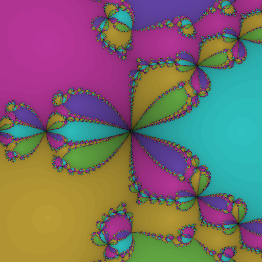

# Newton Fractals
I'm learning rust with this not-very useful but very interesting mathematical project.
Any feeback is appreciated.

The goal of the project is to implement a super-fast [newton fractal](https://en.wikipedia.org/wiki/Newton_fractal) generator,
that would produce pretty pictures like below



## Running locally

The app runs as a web server with a WIP api, you can start the service with

```
cargo run
```

and then open `http://localhost:3000/?pol=-1,0,0,1,0,1&tx=-1&ty=-1&tw=2` in your browser.